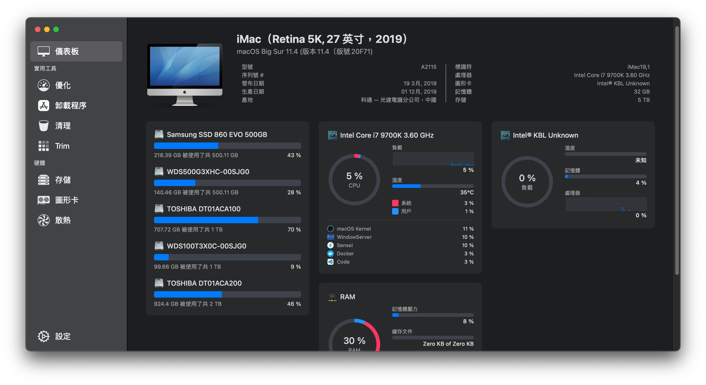

# Hackintosh based on ASUS-Z390-F | Intel i7-9700K | ~~RX 580 8GB~~

English | [中文](./README_cht.md)

Thanks for [OpenCore Desktop Guide](https://dortania.github.io/OpenCore-Install-Guide/config.plist/coffee-lake.html) & [z390-Hack](https://github.com/leto1210/z390-Hack)

### [Changelog](./changelog.md)

### [USB Mapping Explanation (SSDT)](./USB_Mapping.md)

### Parts List
---
Type|Item
:----|:----
**CPU** | Intel - Core i7-9700k 3.6 GHz 8-Core Processor
**CPU Cooler** | Coolermaster MASTERLIQUID ML240L RGB
**Motherboard** | Asus - ROG STRIX Z390-F GAMING ATX LGA1151 Motherboard
**Memory** | Kingston HyperX Predator RGB (Black) DDR4-3200 Memory 32 GB (8G*4)
**Storage NVMe (for Win10)** | WD Black SN750 1TB NVMe PCIe Solid State Drive (WDS100T3X0C) 
**Storage NVMe (for MacOS)** | WD Black SN750 500GB NVMe PCIe Solid State Drive (WDS500G3X0C) 
**Storage SATA III (for game storage)** | Samsung 860 EVO 500 GB SATA 2.5 Inch Internal Solid State Drive (MZ-76E500) 
**Storage SATA III (for data storage)** | Toshiba DT01ACA100-1TB SATAIII 32MB + Toshiba DT01ACA200-2TB SATAIII 32MB
**Graphic Card** | UHD630
-|~~SAPPHIRE - PULSE RX 580 8G G5 '8GB GDDR5, 1366Hz (Boost)'~~
**Case** | In-Win 303C Black PC Case
**Power Supply** | Corsair RM650x (2018) 80+ Gold Certified Fully Modular ATX Power Supply
**Extra** | Airport A1465 BCM943602CS WiFi and BT 4.0 Card to PCI-E Adapter with External Antenna
**Extra** | Antenna extension base from ASUS PCE-AC68

#### Working
---
* Big Sur 11.4 (20F71) OTA from BigSur 11.2 (20D64) successfully
* APFS
* ~~Headless iGPU UHD 630~~
* Wired Ethernet - Intel I219-V PCI Express Gigabit Ethernet
* Wifi / Bluetooth - Airport A1465 (BCM94360CS2)
* Onboard Audio (I can't test digital audio output) - SupremeFX S1220A Realtek ALCS1220A
* USB 2.0, USB 3.1 and USB C
* ~~Sleep/Wake~~
* Quicklook
* Power Nap
* ~~Youtube/Netflix video on Safari~~
* Airdrop
* AirPlay
* Handoff & Continuity
* Facetime
* iMessage
* App Store
* Sidecar

### Bugs
---
* N/A

### Tools
---
* [Etcher](https://www.balena.io/etcher/)
* [Hackintool](http://headsoft.com.au/download/mac/Hackintool.zip)
* [Kext Updater](https://www.kextupdater.de/)
* [Intel Power Gadget](https://software.intel.com/en-us/articles/intel-power-gadget)
* [MacIASL](http://sourceforge.net/projects/maciasl)
* [VideoProc](https://www.videoproc.com/) - Check Hardware Acceleration

### Install
---
1. Check the configuration in BIOS, My Config(./BIOS/v{Version_ID}_setting.txt), 
   you can also import the configuration file (./BIOS/v{Version_ID}_config.CMO).
2. Build your install usb drive, and replace the EFI my release.
