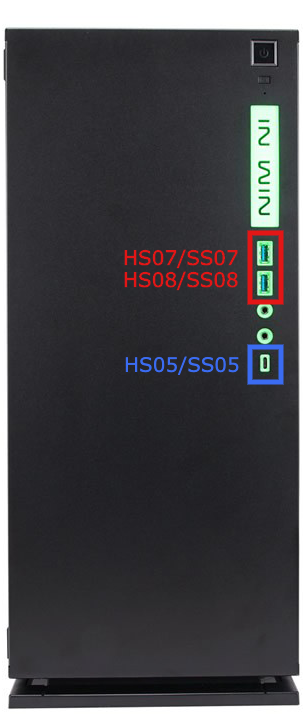

# USB Mapping Explanation (SSDT)

In this configuration, I have done some setting in order to stay within macOS's 15-port limit.

## USB Port List
Port Name|Device|Description, Physical Port (Bios naming)
:----|:----|:----
**HS01**@`Rear Panel` | NuPrime NUDAC (always connect) | G31G2_1
**SS01**@`Rear Panel` | Disable, work as USB 2.0 | DAC deosn't support USB 2.0
|||
**HS02**@`Rear Panel` | HyperX Cloud Flight Wireless Headset (common connect) | G31G2_2
**SS02**@`Rear Panel` | Enable, work as USB 3.1 Gen 2 | I used extension cable, and sometimes, I'll plug 3.1 device to this port
|||
**HS03**@`Rear Panel` | G502 HERO Gaming Mouse (always connect) | G31G2_3
**SS03**@`Rear Panel` | Disable | G502 deosn't support USB 2.0
|||
**HS04**@`Rear Panel` | Type-C USB 3.1 Gen 2 | G31G2_C4
**SS04**@`Rear Panel` | Enable, work as USB 3.1 Gen 2 Type C + Switch | -
|||
**HS05**@`Front Panel` | Type-C USB 3.1 Gen 1 | G31G1_C5
**SS05**@`Front Panel` | Enable, work as USB 3.1 Gen 2 Type C + Switch | -
|||
**HS06**@`Internal` | MB Aura Control USB 2.0 Device (Disable) | USBE12 (not visible)
**SS06**@`Internal` | Disable | -
|||
**HS07**@`Front Panel` | USB 3.1 Gen 1 | G31G1_7
**SS07**@`Front Panel` | Enable, work as USB 3.1 Gen 1 | -
|||
**HS08**@`Front Panel` | USB 3.1 Gen 1 | G31G1_8
**SS08**@`Front Panel` | Enable, work as USB 3.1 Gen 1 | -
|||
**HS09**@`Rear Panel` | Disable | G31G1_9
**SS09**@`Rear Panel` | Disable | -
|||
**HS10**@`Rear Panel` | Disable | USB10
**SS10**@`Rear Panel` | Disable | -
|||
**HS11**@`Internal ` | Disable | USB11
|||
**HS12**@`Internal ` | BRCM20702 Hub (BCM943602CS bluetooth PCI adapter) | USB12
|| Logi G413 has two usb cable, main cable for keyboard, sub cable for led, and extension port|
**HS13**@`Rear Panel` | G413 Carbon Mechanical Gaming Keyboard_Main (always) | -
|||
**HS14**@`Rear Panel` | G413 Carbon Mechanical Gaming Keyboard_Sub | -

# *All of the above, there're 15 ports in total.*
